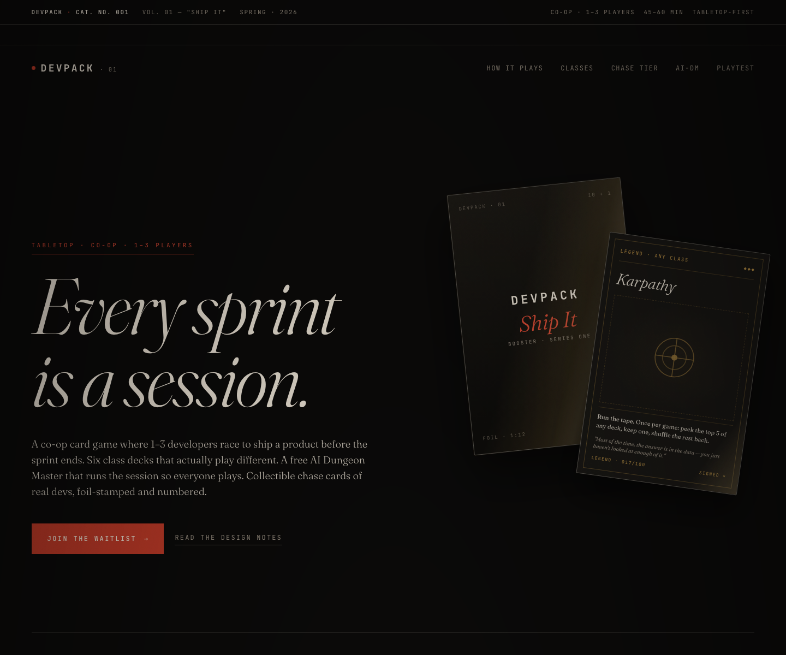
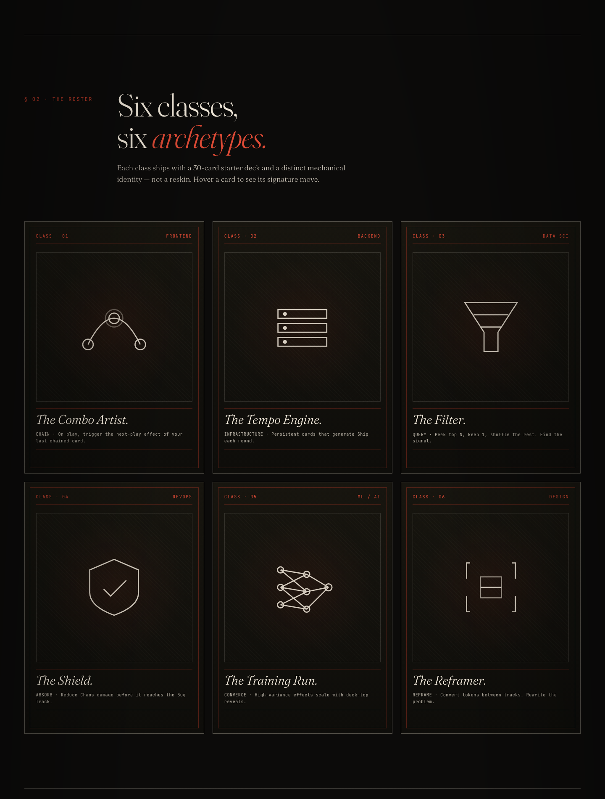
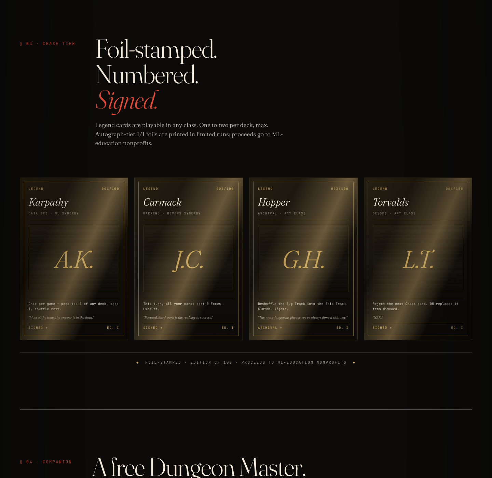
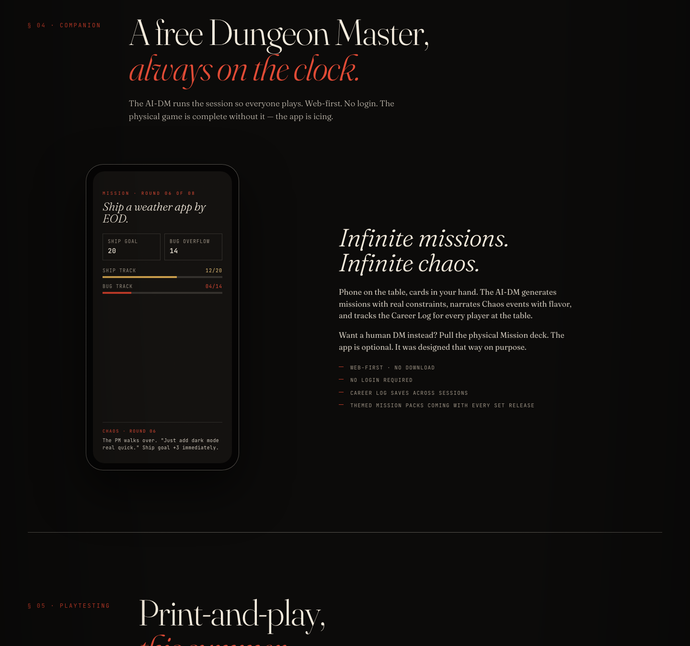

<div align="center">



<br />

# DEVPACK

***A tabletop card game for people who ship.***

A co-op, deck-based card game where 1–3 developers race to ship a product before the sprint ends. Six class decks that play differently. A free AI Dungeon Master. Collectible chase cards of real devs, foil-stamped and numbered.

<br />

<p>
  <a href="https://rdsciv.github.io/devpack/"></a>
  
  
  
</p>

<p>
  <a href="https://rdsciv.github.io/devpack/"><strong>Live site</strong></a>
  &nbsp;·&nbsp;
  <a href="#-the-six-classes"><strong>Classes</strong></a>
  &nbsp;·&nbsp;
  <a href="#-the-chase-tier"><strong>Chase Tier</strong></a>
  &nbsp;·&nbsp;
  <a href="#-the-ai-dungeon-master"><strong>AI-DM</strong></a>
  &nbsp;·&nbsp;
  <a href="docs/superpowers/specs/2026-04-18-devpack-tcg-design.md"><strong>Game design spec</strong></a>
  &nbsp;·&nbsp;
  <a href="#-roadmap"><strong>Roadmap</strong></a>
</p>

</div>

<br />

---

## ◆ What is DEVPACK?

DEVPACK is a physical, **co-op tabletop card game** where the premise is simple: you and your teammates are developers, you have a sprint, and you need to ship. Each player picks a class deck — Frontend, Backend, Data Science, DevOps, ML, or Design — that plays with a genuinely different mechanical identity. Every round the DM (a human friend or a free AI-DM app) reveals a Chaos card: flaky tests, scope creep, prod outage, "the PM wants to just add one more thing."

You race the **Ship Track** before the **Bug Track** overflows. Win together, lose together. Loss isn't punishing — a failed mission adds a *Tech Debt* card to your deck that follows your character through future sessions. The story of your career builds across sprints.

**Lineage:** Gloomhaven × Pandemic × For The Queen. Not Magic. Not Hearthstone. No PvP, ever.

<br />

## ◆ Design pillars

<table>
  <tr>
    <td valign="top" width="33%">
      <h4>Collaborative, never competitive</h4>
      <p>No PvP mechanics. You all win or all lose. This is the differentiator from every other trading card game.</p>
    </td>
    <td valign="top" width="33%">
      <h4>Classes actually play different</h4>
      <p>Six class decks with distinct mechanics — not reskins. A reviewer should be able to say "Frontend plays nothing like Backend" after one game.</p>
    </td>
    <td valign="top" width="34%">
      <h4>Infinite replay via AI-DM</h4>
      <p>The physical game is complete without the app. The app unlocks unbounded Mission + Chaos generation, so the game never runs out of scenarios.</p>
    </td>
  </tr>
  <tr>
    <td valign="top">
      <h4>Tabletop-first</h4>
      <p>Plays great with zero tech. Photographs well. 45–60 min session length. The app is icing, not infrastructure.</p>
    </td>
    <td valign="top">
      <h4>Collectibility is mechanical</h4>
      <p>Chase cards have real game impact. They're not just shiny holos — a Karpathy Legend is <em>good</em>, not decorative.</p>
    </td>
    <td valign="top">
      <h4>Loss is fun</h4>
      <p>A failed mission gives you a Tech Debt card — a persistent negative cleared by future missions. Losing becomes the best story.</p>
    </td>
  </tr>
</table>

<br />

## ◆ The six classes



Each class ships with a 30-card starter deck. Mechanics are distinct — not just different art.

| # | Class | Identity | Core mechanic |
|---|---|---|---|
| 01 | **Frontend** | The Combo Artist | `CHAIN` — trigger the next-play effect of your last chained card |
| 02 | **Backend** | The Tempo Engine | `INFRASTRUCTURE` — persistent cards generate Ship each round |
| 03 | **Data Science** | The Filter | `QUERY` — peek top N, keep 1, shuffle the rest |
| 04 | **DevOps** | The Shield | `ABSORB` — reduce Chaos damage before it reaches the Bug Track |
| 05 | **ML / AI** | The Training Run | `CONVERGE` — high-variance effects scale with deck-top reveals |
| 06 | **Design** | The Reframer | `REFRAME` — convert tokens between tracks, rewrite the problem |

> **Launch roster:** Set 1 (*"Ship It"*) ships with Frontend and Backend. Data Sci, DevOps, ML, and Design arrive across Sets 2–5.

<br />

## ◆ The chase tier



Legend cards are playable in any class. Powerful, flavorful, 1–2 per deck maximum. Foil-stamped, numbered, and for the autograph-tier 1/1s — actually signed by the real person, with proceeds going to ML-education nonprofits.

| Legend | Effect | Edition |
|---|---|---|
| **Karpathy** | Once per game: peek top 5 of any deck, keep one, shuffle the rest. | `LEGEND · 001/100` |
| **Carmack** | This turn, all your cards cost 0 Focus. Exhaust. | `LEGEND · 002/100` |
| **Hopper** | Reshuffle the Bug Track into the Ship Track. Clutch, 1/game. | `LEGEND · 003/100` *(archival)* |
| **Torvalds** | Reject the next Chaos card. DM replaces from discard. Flavor: *"NAK."* | `LEGEND · 004/100` |

Also in the chase tier: **Repos** (artifact relics like `torvalds/linux`, `tensorflow/tensorflow`, the infamous `leftpad`) and **Bugs** (villain-tier cards in the Chaos deck: Heartbleed, Log4Shell, Y2K, Therac-25).

<br />

## ◆ The AI Dungeon Master



The AI-DM is a **free web app** that runs the session so everyone plays. It generates missions with real constraints, narrates Chaos events with flavor, and tracks the Career Log for every player at the table.

- **Web-first.** No download. No login required.
- **Optional, not required.** The physical game is self-contained. Pull missions from the deck if you'd rather play analog.
- **Persistence.** Career Log saves across sessions, tracks Tech Debt, unlocks career milestones.
- **Expansion surface.** Themed mission packs ship with every set release.

<br />

## ◆ Quick start

No build step. No dependencies. It's one HTML file and some screenshots.

```bash
# Clone
git clone https://github.com/rdsciv/devpack.git
cd devpack

# Serve locally (pick one)
python3 -m http.server 8000        # → http://localhost:8000
npx serve .                        # → http://localhost:3000
open index.html                    # → file://...

# Deploy
vercel                             # → https://<your-project>.vercel.app
```

The site is deployed via **GitHub Pages** from `main`/root. Any push updates production.

<br />

## ◆ Project structure

```
devpack/
├── index.html                                     # single-file landing page
├── docs/
│   ├── assets/
│   │   ├── banner.png                             # hero screenshot
│   │   ├── classes.png                            # class grid screenshot
│   │   ├── chase.png                              # legend tier screenshot
│   │   └── dm.png                                 # AI-DM screenshot
│   └── superpowers/
│       └── specs/
│           ├── 2026-04-18-devpack-tcg-design.md            # full game design spec
│           └── 2026-04-18-claude-design-landing-prompt.md  # landing design brief
├── README.md
└── .gitignore
```

<br />

## ◆ Design philosophy

<table>
  <tr>
    <td valign="top" width="50%">
      <h4>Typography</h4>
      <ul>
        <li><a href="https://fonts.google.com/specimen/Fraunces">Fraunces</a> — variable serif, optical sizing, editorial tone</li>
        <li><a href="https://fonts.google.com/specimen/JetBrains+Mono">JetBrains Mono</a> — wordmark, card rules text, meta labels</li>
      </ul>
    </td>
    <td valign="top" width="50%">
      <h4>Palette</h4>
      <ul>
        <li><code>#0C0B0A</code> — ink (page background)</li>
        <li><code>#F4EBDC</code> — warm paper (primary text)</li>
        <li><code>#C23B28</code> — vermillion ember (accent)</li>
        <li><code>#C89B4A</code> — foil gold (Legend tier)</li>
      </ul>
    </td>
  </tr>
</table>

**Inspirations:** Linear × Field Notes × the Criterion Collection.
**Explicitly avoided:** purple gradients, Inter/Roboto/Space Grotesk, stock photography, AI-generated hands-on-keyboards, crypto/web3 vocabulary, emoji.
**Anti-tracking:** no analytics, no third-party scripts, no service workers. Respects `prefers-reduced-motion`.

<br />

## ◆ Roadmap

### v0 — Concept *(you are here)*

- [x] Game design specification
- [x] Landing page concept site
- [x] GitHub repo + Pages deployment

### v1 — Playtest *(Summer 2026)*

- [ ] Waitlist backend (replace stubbed `console.log`)
- [ ] Print-and-play PDF (Set 1: *"Ship It"*, Frontend + Backend)
- [ ] Tabletop Simulator module
- [ ] In-person playtest sessions: Brooklyn · SF · Berlin · Austin
- [ ] Structured playtest feedback loop

### v2 — Production *(Late 2026)*

- [ ] Card art commissions (illustrator + foil specialist)
- [ ] AI-DM companion app ([separate repo](#))
- [ ] Legend licensing agreements (charity tie-ins)
- [ ] Kickstarter campaign
- [ ] First print run

### v3 — Expansion *(2027+)*

- [ ] Set 2: *"Agent Era"* (adds ML class, AI-themed Legends)
- [ ] Set 3: *"Open Source"* (DevOps + Data Sci, Repo tier expansion)
- [ ] Set 4: *"Incident"* (crisis missions, Bug tier expansion)
- [ ] Retail distribution

<br />

## ◆ Contributing

Not yet accepting external mechanical changes — the design is under active iteration and balance tuning is sensitive. That said:

- **Found a bug in the landing page?** Open an issue.
- **Want to playtest?** Join the waitlist on the [live site](https://rdsciv.github.io/devpack/).
- **Have a Legend card idea?** Open a discussion with the card name, effect, and flavor text.
- **Licensing / press / sponsorship?** `press@devpack.game`

<br />

## ◆ License

This repo uses **split licensing**.

| What | License |
|---|---|
| Code in `index.html`, CSS, JavaScript, `.gitignore` | [MIT](#) — do what you want |
| Game design, card names, rules text, flavor text, logos, trade dress | © 2026 DEVPACK · All rights reserved |
| Screenshots in `docs/assets/` | © 2026 DEVPACK · All rights reserved |
| Spec documents in `docs/superpowers/specs/` | © 2026 DEVPACK · All rights reserved |

The split is intentional. The technical scaffolding is a landing page anyone can learn from; the game itself is a product we're building.

<br />

## ◆ Acknowledgements

Design lineage we're indebted to: [Gloomhaven](https://boardgamegeek.com/boardgame/174430/gloomhaven) (Isaac Childres) for co-op campaign play, [Pandemic](https://boardgamegeek.com/boardgame/30549/pandemic) (Matt Leacock) for shared-failure tension, [Slay the Spire](https://www.megacrit.com/) for deck-building hand economy, and [For The Queen](https://www.alderac.com/for-the-queen/) (Alex Roberts) for GM-lite narrative prompts.

Type: [Fraunces](https://fonts.google.com/specimen/Fraunces) by Undercase Type. Mono: [JetBrains Mono](https://www.jetbrains.com/mono/). Shields: [shields.io](https://shields.io/). Hosting: GitHub Pages.

<br />

<div align="center">

<sub>◆ <strong>DEVPACK</strong> · Cat. No. 001 · Vol. 01 · Spring 2026 · Printed in Brooklyn ◆</sub>

</div>
